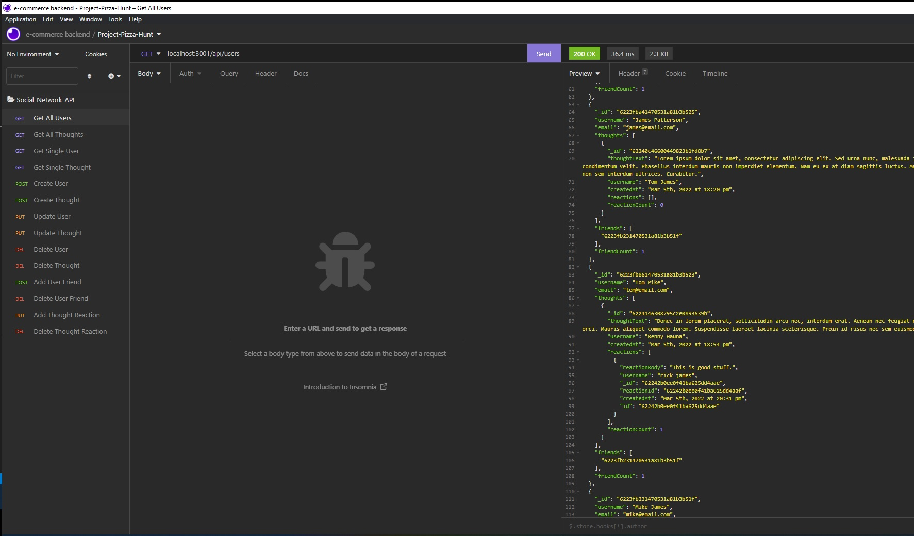
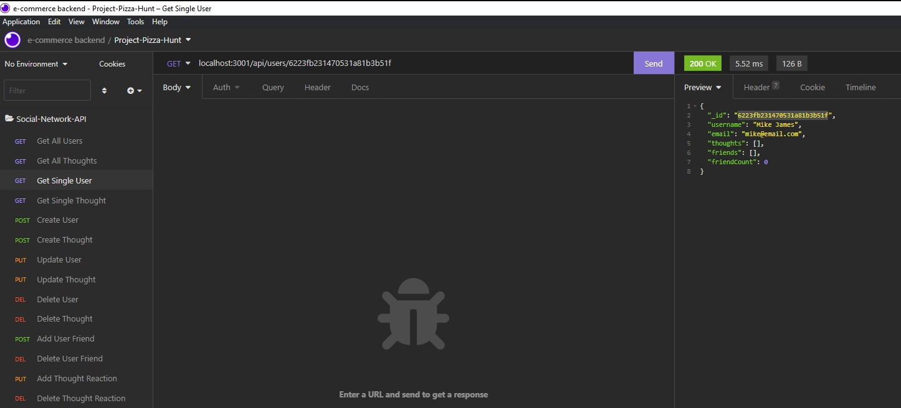
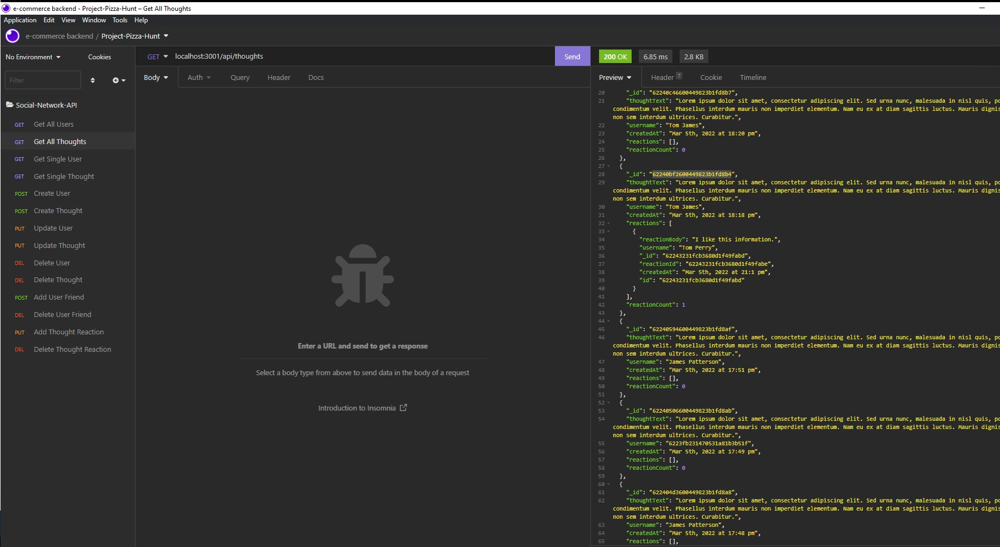
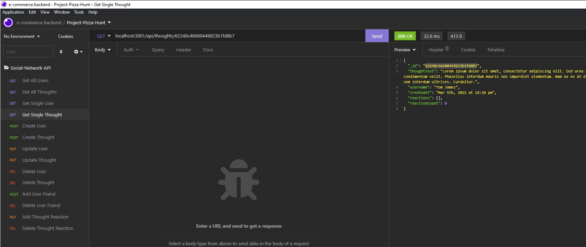

# Social Network-API-Ch18
## Created by Scott Nichols

 
 -------------------------------
## Description 
 This node.js based RESTful API can be used by web based social networking application to create, read, update, and delete users. It also provides the same functionality to do the same with personal thoughts users wish to share online.  It provides the functionality to create friend groups, share thoughts on any topic with this group of friends, and post reactions to other friend's thoughts. It uses MongoDB for the backend storage, and uses Mongoose and Express.js to organize and route the data to the frontend.

## Table of Contents:
  * [Installation](#installation)
  * [Usage](#usage)
  * [License](#license)
  * [Contributing](#contributing)
  * [Tests](#tests)
  * [Questions](#questions)
 --------------------------------- 
## Installation
  To personally run this API, the user will need to download the following:
  - A code editor like VSCode
  - node.js
  - mongoDB
  - npm Express module
  - npm Mongoose module
  - CLI Terminal like Bash

## Usage
  To access the API for a social network application, the best option will be for the user to clone the GitHub repository in order to look at the routing to accurately code the frontend calls to the API.
  
## License Details:
 [Link to MIT License Details](https://choosealicense.com/licenses/mit/)

## Tests
  No tests included for this application.

## Contributing
  * Scott Nichols

 ---------------------------------
### Questions
* Github Profile: https://github.com/Sessions21/social-network-API-Ch18-sfn
* Link to video walk through: https://www.awesomescreenshot.com/video/7752931?key=7f9aab91a0fb340ffcdd685b3393817b
* Contact me with questions: s21nichols@hotmail.com

### Example Insomnia GET, POST, PUT, and DELETE Screenshots:

